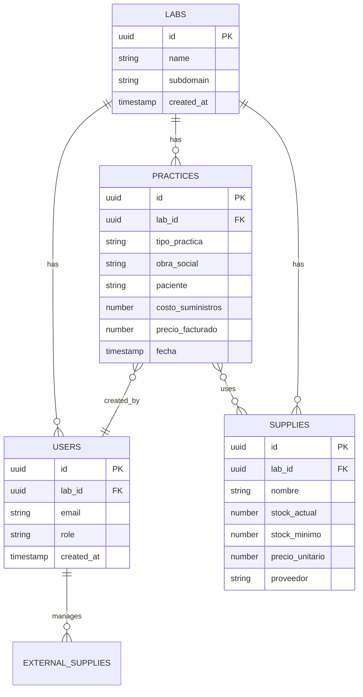

## Descripción General

Optacost utiliza **PostgreSQL** como motor de base de datos, gestionado a través de **Supabase**, lo que proporciona:

- Base de datos relacional robusta y escalable
- Actualizaciones en tiempo real (Realtime)
- Row Level Security (RLS) para aislamiento multi-tenant
- Backups automáticos
- APIs generadas automáticamente

## Esquema de Base de Datos

### Diagrama Entidad-Relación



## Tablas Principales

### `labs`

Tabla principal que representa cada laboratorio (tenant).

```sql
CREATE TABLE labs (
    id UUID PRIMARY KEY DEFAULT uuid_generate_v4(),
    name TEXT NOT NULL,
    subdomain TEXT UNIQUE NOT NULL,
    created_at TIMESTAMP WITH TIME ZONE DEFAULT NOW(),
    settings JSONB DEFAULT '{}'::JSONB
);
```

<Note>
Cada laboratorio tiene un subdominio único (ej: `mi-lab.optacost.com`)
</Note>

### `users`

Usuarios del sistema, asociados a un laboratorio.

```sql
CREATE TABLE users (
    id UUID PRIMARY KEY REFERENCES auth.users(id),
    lab_id UUID REFERENCES labs(id) ON DELETE CASCADE,
    email TEXT UNIQUE NOT NULL,
    role TEXT NOT NULL DEFAULT 'user',
    full_name TEXT,
    created_at TIMESTAMP WITH TIME ZONE DEFAULT NOW(),
    CONSTRAINT valid_role CHECK (role IN ('admin', 'user', 'viewer'))
);
```

### `practices`

Prácticas médicas realizadas.

```sql
CREATE TABLE practices (
    id UUID PRIMARY KEY DEFAULT uuid_generate_v4(),
    lab_id UUID REFERENCES labs(id) ON DELETE CASCADE,
    tipo_practica TEXT NOT NULL,
    obra_social TEXT NOT NULL,
    paciente TEXT,
    fecha TIMESTAMP WITH TIME ZONE NOT NULL,
    costo_suministros NUMERIC(10,2) NOT NULL,
    precio_facturado NUMERIC(10,2) NOT NULL,
    notas TEXT,
    created_by UUID REFERENCES users(id),
    created_at TIMESTAMP WITH TIME ZONE DEFAULT NOW()
);
```

### `supplies`

Inventario de suministros.

```sql
CREATE TABLE supplies (
    id UUID PRIMARY KEY DEFAULT uuid_generate_v4(),
    lab_id UUID REFERENCES labs(id) ON DELETE CASCADE,
    nombre TEXT NOT NULL,
    codigo TEXT,
    categoria TEXT NOT NULL,
    stock_actual INTEGER NOT NULL DEFAULT 0,
    stock_minimo INTEGER NOT NULL DEFAULT 0,
    precio_unitario NUMERIC(10,2) NOT NULL,
    proveedor TEXT,
    created_at TIMESTAMP WITH TIME ZONE DEFAULT NOW(),
    updated_at TIMESTAMP WITH TIME ZONE DEFAULT NOW()
);
```

### `practice_supplies`

Tabla de relación entre prácticas y suministros.

```sql
CREATE TABLE practice_supplies (
    id UUID PRIMARY KEY DEFAULT uuid_generate_v4(),
    practice_id UUID REFERENCES practices(id) ON DELETE CASCADE,
    supply_id UUID REFERENCES supplies(id) ON DELETE RESTRICT,
    cantidad INTEGER NOT NULL,
    precio_unitario_at_time NUMERIC(10,2) NOT NULL
);
```

## Row Level Security (RLS)

Todas las tablas implementan RLS para asegurar el aislamiento multi-tenant:

```sql
-- Ejemplo de política RLS para practices
CREATE POLICY "Users can only see practices from their lab"
ON practices
FOR SELECT
USING (
    lab_id IN (
        SELECT lab_id
        FROM users
        WHERE id = auth.uid()
    )
);

CREATE POLICY "Users can insert practices to their lab"
ON practices
FOR INSERT
WITH CHECK (
    lab_id IN (
        SELECT lab_id
        FROM users
        WHERE id = auth.uid()
    )
);
```

<Warning>
Nunca deshabilites RLS en producción. Es crucial para la seguridad multi-tenant
</Warning>

## Índices

Para optimizar el rendimiento, se crean índices estratégicos:

```sql
-- Índices en practices
CREATE INDEX idx_practices_lab_id ON practices(lab_id);
CREATE INDEX idx_practices_fecha ON practices(fecha DESC);
CREATE INDEX idx_practices_obra_social ON practices(obra_social);

-- Índices en supplies
CREATE INDEX idx_supplies_lab_id ON supplies(lab_id);
CREATE INDEX idx_supplies_nombre ON supplies(nombre);
CREATE INDEX idx_supplies_stock ON supplies(stock_actual) WHERE stock_actual < stock_minimo;
```

## Triggers

### Actualización automática de timestamps

```sql
CREATE OR REPLACE FUNCTION update_updated_at()
RETURNS TRIGGER AS $$
BEGIN
    NEW.updated_at = NOW();
    RETURN NEW;
END;
$$ LANGUAGE plpgsql;

CREATE TRIGGER update_supplies_updated_at
    BEFORE UPDATE ON supplies
    FOR EACH ROW
    EXECUTE FUNCTION update_updated_at();
```

### Actualización de stock automática

```sql
CREATE OR REPLACE FUNCTION update_supply_stock()
RETURNS TRIGGER AS $$
BEGIN
    IF TG_OP = 'INSERT' THEN
        UPDATE supplies
        SET stock_actual = stock_actual - NEW.cantidad
        WHERE id = NEW.supply_id;
    ELSIF TG_OP = 'DELETE' THEN
        UPDATE supplies
        SET stock_actual = stock_actual + OLD.cantidad
        WHERE id = OLD.supply_id;
    END IF;
    RETURN NEW;
END;
$$ LANGUAGE plpgsql;

CREATE TRIGGER update_stock_on_practice
    AFTER INSERT OR DELETE ON practice_supplies
    FOR EACH ROW
    EXECUTE FUNCTION update_supply_stock();
```

## Vistas

### Vista de prácticas con detalles completos

```sql
CREATE VIEW practices_with_details AS
SELECT
    p.*,
    u.full_name as created_by_name,
    l.name as lab_name,
    (p.precio_facturado - p.costo_suministros) as margen,
    ROUND(((p.precio_facturado - p.costo_suministros) / p.precio_facturado * 100), 2) as margen_porcentaje
FROM practices p
JOIN users u ON p.created_by = u.id
JOIN labs l ON p.lab_id = l.id;
```

## Migraciones

Las migraciones se gestionan con Supabase CLI:

```bash
# Crear nueva migración
supabase migration new nombre_migracion

# Aplicar migraciones
supabase db push

# Ver estado de migraciones
supabase migration list
```

## Backups

Supabase realiza backups automáticos:
- **Backups diarios**: Retención de 7 días (plan gratuito)
- **Backups semanales**: Retención de 30 días (plan pro)
- **Point-in-time recovery**: Disponible en plan enterprise

Adicionalmente, Optacost implementa su propio sistema de backups (ver [Backups](/caracteristicas/backups)).

## Rendimiento

### Optimizaciones Implementadas

<CardGroup cols={2}>
  <Card title="Connection Pooling" icon="link">
    Supabase Pooler para manejar miles de conexiones
  </Card>
  <Card title="Prepared Statements" icon="bolt">
    Queries precompiladas para mejor rendimiento
  </Card>
  <Card title="Índices Estratégicos" icon="magnifying-glass">
    Índices en columnas frecuentemente consultadas
  </Card>
  <Card title="Materialized Views" icon="table">
    Para reportes complejos y agregaciones
  </Card>
</CardGroup>

## Monitoreo

Supabase Dashboard proporciona:
- Métricas de uso de CPU y memoria
- Tamaño de base de datos
- Queries lentas
- Conexiones activas
- Logs en tiempo real

## Siguiente Paso

<Card title="Roles y Permisos" icon="shield-halved" href="/arquitectura/roles-y-permisos">
  Aprende cómo funciona el sistema de permisos y roles de usuarios
</Card>
