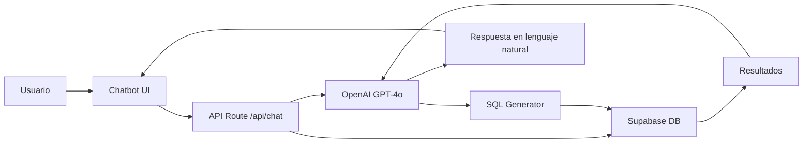

## Descripción General

Optacost integra **OpenAI GPT-4o** para proporcionar un asistente inteligente que:

- Responde preguntas en lenguaje natural sobre tus datos
- Genera consultas SQL automáticamente
- Proporciona análisis e insights
- Ayuda con el uso del sistema

<Note>
La integración usa el **nuevo modelo GPT-4o** (omni) que combina capacidades de texto, visión y razonamiento avanzado
</Note>

## Arquitectura del Chatbot



## Flujo de Funcionamiento

<Steps>
  <Step title="Usuario hace una pregunta">
    Ejemplo: *"¿Cuánto gastamos en suministros el mes pasado?"*
  </Step>

  <Step title="El prompt se envía a GPT-4o">
    Incluye contexto del usuario (lab_id) y schema de la base de datos
  </Step>

  <Step title="GPT-4o genera SQL">
    ```sql
    SELECT SUM(costo_suministros)
    FROM practices
    WHERE lab_id = 'xxx'
    AND fecha >= '2024-11-01'
    AND fecha < '2024-12-01'
    ```
  </Step>

  <Step title="Se ejecuta la query con RLS">
    Supabase aplica automáticamente Row Level Security
  </Step>

  <Step title="GPT-4o interpreta los resultados">
    Convierte los datos en una respuesta clara y útil
  </Step>

  <Step title="Usuario recibe la respuesta">
    *"El mes pasado gastaste $36,250 en suministros..."*
  </Step>
</Steps>

## Implementación Técnica

### Endpoint de Chat

```typescript
// app/api/chat/route.ts
import OpenAI from 'openai';
import { createClient } from '@/lib/supabase/server';

const openai = new OpenAI({
  apiKey: process.env.OPENAI_API_KEY,
});

export async function POST(request: Request) {
  const { message, conversation_id } = await request.json();

  // Obtener contexto del usuario
  const supabase = createClient();
  const { data: { user } } = await supabase.auth.getUser();

  // Obtener schema de la base de datos
  const dbSchema = await getDBSchema(user.lab_id);

  // Crear prompt con contexto
  const systemPrompt = `
    Eres un asistente para Optacost, un sistema de gestión de laboratorios.

    El usuario pertenece al laboratorio: ${user.lab_id}

    Schema de la base de datos:
    ${dbSchema}

    Cuando el usuario haga preguntas sobre datos:
    1. Genera una query SQL válida
    2. Ejecuta la query
    3. Interpreta los resultados en lenguaje natural

    IMPORTANTE: Siempre incluye WHERE lab_id = '${user.lab_id}' en las queries.
  `;

  // Llamar a GPT-4o
  const completion = await openai.chat.completions.create({
    model: "gpt-4o",
    messages: [
      { role: "system", content: systemPrompt },
      { role: "user", content: message }
    ],
    functions: [
      {
        name: "execute_sql",
        description: "Ejecuta una query SQL en la base de datos",
        parameters: {
          type: "object",
          properties: {
            query: {
              type: "string",
              description: "La query SQL a ejecutar"
            }
          },
          required: ["query"]
        }
      }
    ],
    function_call: "auto"
  });

  // Si GPT-4o quiere ejecutar SQL
  if (completion.choices[0].message.function_call) {
    const { query } = JSON.parse(
      completion.choices[0].message.function_call.arguments
    );

    // Ejecutar query de forma segura
    const results = await executeSecureQuery(supabase, query, user.lab_id);

    // Enviar resultados de vuelta a GPT-4o para interpretación
    const finalCompletion = await openai.chat.completions.create({
      model: "gpt-4o",
      messages: [
        { role: "system", content: systemPrompt },
        { role: "user", content: message },
        completion.choices[0].message,
        {
          role: "function",
          name: "execute_sql",
          content: JSON.stringify(results)
        }
      ]
    });

    return Response.json({
      response: finalCompletion.choices[0].message.content,
      data: results
    });
  }

  return Response.json({
    response: completion.choices[0].message.content
  });
}
```

### Seguridad en Queries

```typescript
// lib/secure-query.ts
export async function executeSecureQuery(
  supabase: SupabaseClient,
  query: string,
  lab_id: string
) {
  // Validar que la query solo haga SELECT
  if (!query.trim().toLowerCase().startsWith('select')) {
    throw new Error('Only SELECT queries are allowed');
  }

  // Validar que incluya el lab_id correcto
  if (!query.includes(`lab_id = '${lab_id}'`)) {
    throw new Error('Query must filter by lab_id');
  }

  // Ejecutar con timeout
  const { data, error } = await supabase.rpc('execute_safe_query', {
    query_text: query,
    timeout_ms: 5000
  });

  if (error) throw error;

  return data;
}
```

## Prompts del Sistema

### Prompt Principal

```
Eres un asistente experto en Optacost, un sistema de gestión de costos para laboratorios médicos.

Tu objetivo es ayudar a los usuarios a:
1. Consultar sus datos (prácticas, suministros, costos)
2. Generar análisis e insights
3. Responder preguntas sobre cómo usar el sistema

Capacidades:
- Puedes ejecutar queries SQL en la base de datos
- Tienes acceso al schema completo
- Puedes generar visualizaciones de datos
- Conoces todas las funcionalidades del sistema

Restricciones:
- Solo queries SELECT (no modificar datos)
- Siempre filtrar por lab_id del usuario autenticado
- Timeout de 5 segundos en queries
- Máximo 1000 registros por query

Tono:
- Amigable y profesional
- Claro y conciso
- Usa ejemplos cuando sea útil
- Si no estás seguro, pregunta para clarificar
```

### Prompt para SQL Generation

```
Basándote en el schema de la base de datos proporcionado, genera una query SQL que responda la pregunta del usuario.

Reglas:
1. Solo usa tablas y columnas que existen en el schema
2. Siempre incluye: WHERE lab_id = '{lab_id}'
3. Usa JOINs cuando sea necesario
4. Limita resultados a 100 registros max
5. Usa funciones de agregación cuando corresponda
6. Formatea fechas correctamente
7. Optimiza la query para rendimiento

Ejemplo:
Pregunta: "¿Cuántas prácticas hice este mes?"
Query:
SELECT COUNT(*) as total
FROM practices
WHERE lab_id = '{lab_id}'
AND fecha >= date_trunc('month', CURRENT_DATE)
AND fecha < date_trunc('month', CURRENT_DATE) + interval '1 month'
```

## Componente de UI

```tsx
// components/chatbot/chatbot-popup.tsx
'use client';

import { useState } from 'react';
import { Button } from '@/components/ui/button';
import { Input } from '@/components/ui/input';
import { ScrollArea } from '@/components/ui/scroll-area';

export function ChatbotPopup() {
  const [messages, setMessages] = useState([]);
  const [input, setInput] = useState('');
  const [loading, setLoading] = useState(false);

  const sendMessage = async () => {
    if (!input.trim()) return;

    const userMessage = { role: 'user', content: input };
    setMessages(prev => [...prev, userMessage]);
    setInput('');
    setLoading(true);

    try {
      const response = await fetch('/api/chat', {
        method: 'POST',
        headers: { 'Content-Type': 'application/json' },
        body: JSON.stringify({ message: input })
      });

      const data = await response.json();

      setMessages(prev => [...prev, {
        role: 'assistant',
        content: data.response,
        data: data.data
      }]);
    } catch (error) {
      console.error('Error:', error);
    } finally {
      setLoading(false);
    }
  };

  return (
    <div className="fixed bottom-4 right-4 w-96 h-[500px] bg-white rounded-lg shadow-xl">
      <ScrollArea className="h-[400px] p-4">
        {messages.map((msg, i) => (
          <div key={i} className={`mb-4 ${msg.role === 'user' ? 'text-right' : 'text-left'}`}>
            <div className={`inline-block p-3 rounded-lg ${
              msg.role === 'user' ? 'bg-blue-500 text-white' : 'bg-gray-200'
            }`}>
              {msg.content}
            </div>
          </div>
        ))}
        {loading && <div>Pensando...</div>}
      </ScrollArea>

      <div className="p-4 border-t">
        <Input
          value={input}
          onChange={(e) => setInput(e.target.value)}
          onKeyPress={(e) => e.key === 'Enter' && sendMessage()}
          placeholder="Pregunta algo..."
        />
      </div>
    </div>
  );
}
```

## Costos de OpenAI

### Modelo GPT-4o

Pricing (a diciembre 2024):
- **Input**: $2.50 por 1M tokens
- **Output**: $10.00 por 1M tokens

Estimación de costos:
- Pregunta promedio: ~500 tokens input + 300 tokens output = $0.004
- 1000 preguntas/mes: ~$4.00/mes
- 10,000 preguntas/mes: ~$40.00/mes

<Tip>
Implementa caché de respuestas comunes para reducir costos
</Tip>

## Optimizaciones

### Caché de Respuestas

```typescript
// lib/chat-cache.ts
import { Redis } from '@upstash/redis';

const redis = new Redis({
  url: process.env.UPSTASH_REDIS_URL,
  token: process.env.UPSTASH_REDIS_TOKEN,
});

export async function getCachedResponse(message: string, lab_id: string) {
  const key = `chat:${lab_id}:${hashMessage(message)}`;
  return await redis.get(key);
}

export async function setCachedResponse(
  message: string,
  lab_id: string,
  response: string
) {
  const key = `chat:${lab_id}:${hashMessage(message)}`;
  await redis.set(key, response, { ex: 3600 }); // 1 hora
}
```

### Streaming de Respuestas

```typescript
// Para respuestas más rápidas
const stream = await openai.chat.completions.create({
  model: "gpt-4o",
  messages: [...],
  stream: true,
});

for await (const chunk of stream) {
  const content = chunk.choices[0]?.delta?.content || '';
  // Enviar chunk al cliente vía Server-Sent Events
}
```

## Limitaciones

- Solo queries SELECT (no modificaciones)
- Timeout de 5 segundos por query
- Máximo 1000 registros por resultado
- Rate limit: 10 mensajes por minuto por usuario

## Próximas Mejoras

- Soporte para gráficos generados por IA
- Análisis predictivo con machine learning
- Recomendaciones automáticas de optimización
- Voz: pregunta hablando al chatbot

## Siguiente Paso

<Card title="Guías de Uso" icon="book" href="/guias/usar-chatbot">
  Aprende a usar el chatbot de manera efectiva con ejemplos prácticos
</Card>
