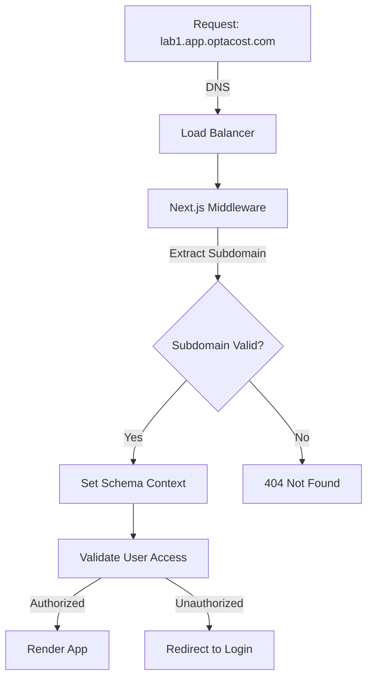

## Visión General

Optacost implementa una **arquitectura multi-tenant robusta** que garantiza el aislamiento completo de datos entre clientes mediante una combinación de:

- **Subdominios dedicados** por cliente
- **Schemas PostgreSQL separados** por tenant
- **Row Level Security (RLS)** de Supabase
- **Middleware de validación** en Next.js

## Modelo de Tenancy

### Schema por Tenant

Cada cliente tiene su propio schema de base de datos:

```sql
-- Cliente: "laboratorio-central"
CREATE SCHEMA IF NOT EXISTS client_laboratorio_central;

-- Todas las tablas del cliente
CREATE TABLE client_laboratorio_central.practices (...);
CREATE TABLE client_laboratorio_central.supplies (...);
CREATE TABLE client_laboratorio_central.users (...);
-- 40+ tablas adicionales...
```

<Info>
Este enfoque garantiza **aislamiento total** a nivel de base de datos. Los datos de un cliente son completamente inaccesibles para otros.
</Info>

### Ventajas del Schema Isolation

<CardGroup cols={2}>
  <Card title="Seguridad Máxima" icon="shield">
    Imposible acceder a datos de otros clientes
  </Card>
  <Card title="Performance" icon="gauge-high">
    Índices y queries optimizados por cliente
  </Card>
  <Card title="Backups Independientes" icon="database">
    Cada cliente puede tener su propia política de respaldo
  </Card>
  <Card title="Personalización" icon="sliders">
    Schemas pueden tener extensiones o tablas custom
  </Card>
</CardGroup>

## Arquitectura de Subdominio

### Estructura de URLs

```
https://{tenant}.app.optacost.com
         ↑
    Subdominio del cliente
```

**Ejemplos:**
```
https://laboratorio-central.app.optacost.com
https://diagnostico-medico.app.optacost.com
https://clinica-norte.app.optacost.com
```

### Flujo de Routing



## Implementación en Next.js

### Middleware de Validación

El middleware intercepta todas las peticiones:

```typescript
// middleware.ts
import { NextRequest, NextResponse } from 'next/server'

export function middleware(request: NextRequest) {
  const hostname = request.headers.get('host') || ''

  // Extraer subdominio
  // Formato: {subdomain}.app.optacost.com
  const subdomain = hostname.split('.')[0]

  // Validar que el subdominio sea válido
  if (!isValidSubdomain(subdomain)) {
    return NextResponse.redirect('/404')
  }

  // Reescribir URL internamente para Next.js
  // /path -> /[subdomain]/path
  const url = request.nextUrl.clone()
  url.pathname = `/${subdomain}${url.pathname}`

  return NextResponse.rewrite(url)
}

export const config = {
  matcher: [
    '/((?!api|_next/static|_next/image|favicon.ico).*)',
  ],
}
```

### Carpeta de Routing Dynamic

```
app/
├── [subdomain]/           # Dynamic subdomain routing
│   ├── dashboard/
│   ├── practices/
│   ├── supplies/
│   ├── users/
│   └── layout.tsx
├── app/                   # Auth subdomain
│   ├── login/
│   ├── forgot-password/
│   └── reset-password/
└── page.tsx               # Landing page
```

## Conexión a Base de Datos

### Schema Context

Cada petición establece el schema correcto:

```typescript
// lib/use-supabase-client.ts
import { createClientComponentClient } from '@supabase/auth-helpers-nextjs'

export function useSupabaseClient() {
  const subdomain = getSubdomainFromURL()
  const schema = `client_${subdomain}`

  const supabase = createClientComponentClient({
    supabaseUrl: process.env.NEXT_PUBLIC_SUPABASE_URL,
    supabaseKey: process.env.NEXT_PUBLIC_SUPABASE_ANON_KEY,
    options: {
      db: { schema }
    }
  })

  return supabase
}
```

### Query con Schema Isolation

```typescript
// Automáticamente usa el schema del cliente
const { data: practices } = await supabase
  .from('practices') // Realmente: client_{subdomain}.practices
  .select('*')
```

## Row Level Security (RLS)

### Políticas de Seguridad

Además del schema isolation, RLS agrega una capa extra:

```sql
-- Política: Users solo ven datos de su cliente
CREATE POLICY "tenant_isolation" ON practices
FOR ALL
USING (
  current_schema() = 'client_' || auth.jwt() ->> 'subdomain'
);

-- Política: Users solo modifican sus propios datos
CREATE POLICY "user_own_data" ON user_settings
FOR UPDATE
USING (
  user_id = auth.uid()
);
```

### JWT Claims

El token JWT incluye información del tenant:

```json
{
  "sub": "user-uuid-123",
  "email": "admin@laboratorio.com",
  "role": 1,
  "subdomain": "laboratorio-central",
  "client_id": 45,
  "aud": "authenticated",
  "exp": 1640000000
}
```

## Tabla de Clientes Global

### Schema Público

Existe un schema `public` para datos compartidos:

```sql
-- public.clients - Tabla maestra de clientes
CREATE TABLE public.clients (
  id SERIAL PRIMARY KEY,
  subdomain VARCHAR(100) UNIQUE NOT NULL,
  name VARCHAR(255) NOT NULL,
  status VARCHAR(20) DEFAULT 'active',
  created_at TIMESTAMP DEFAULT NOW(),
  settings JSONB
);

-- public.users - Usuarios con referencia a clientes
CREATE TABLE public.users (
  id UUID PRIMARY KEY,
  email VARCHAR(255) UNIQUE NOT NULL,
  client_id INTEGER REFERENCES public.clients(id),
  role INTEGER NOT NULL,
  created_at TIMESTAMP DEFAULT NOW()
);
```

### Relación Cliente-Schema

```typescript
// Mapeo de cliente a schema
interface Client {
  id: number
  subdomain: string
  name: string
  schema: string // "client_{subdomain}"
  status: 'active' | 'inactive' | 'maintenance'
}
```

## Provisioning de Nuevos Clientes

### Proceso de Alta

<Steps>
  <Step title="Crear registro en public.clients">
    ```sql
    INSERT INTO public.clients (subdomain, name, status)
    VALUES ('nuevo-lab', 'Nuevo Laboratorio', 'active');
    ```
  </Step>

  <Step title="Crear schema dedicado">
    ```sql
    CREATE SCHEMA IF NOT EXISTS client_nuevo_lab;
    ```
  </Step>

  <Step title="Clonar estructura de tablas">
    ```sql
    -- Script automatizado que copia estructura
    SELECT clone_schema_structure(
      'template_client',
      'client_nuevo_lab'
    );
    ```
  </Step>

  <Step title="Crear usuario administrador">
    ```sql
    INSERT INTO public.users (email, client_id, role)
    VALUES ('admin@nuevo-lab.com', {client_id}, 1);
    ```
  </Step>

  <Step title="Configurar DNS">
    Agregar registro DNS para `nuevo-lab.app.optacost.com`
  </Step>
</Steps>

### Script de Provisioning

```typescript
// db/cloneSchema.ts
async function provisionNewClient(subdomain: string, name: string) {
  // 1. Crear cliente
  const { data: client } = await supabase
    .from('clients')
    .insert({ subdomain, name })
    .select()
    .single()

  // 2. Crear schema
  await supabase.rpc('create_client_schema', {
    schema_name: `client_${subdomain}`
  })

  // 3. Clonar tablas
  await supabase.rpc('clone_schema_structure', {
    source: 'template_client',
    target: `client_${subdomain}`
  })

  // 4. Inicializar datos default
  await initializeDefaultData(`client_${subdomain}`)

  return client
}
```

## Gestión de Schemas

### Migraciones

Aplicar cambios a todos los clientes:

```typescript
// Obtener todos los schemas de clientes
const { data: clients } = await supabase
  .from('clients')
  .select('subdomain')

// Aplicar migración a cada schema
for (const client of clients) {
  const schema = `client_${client.subdomain}`

  await supabase.rpc('execute_on_schema', {
    schema_name: schema,
    sql_query: `
      ALTER TABLE practices
      ADD COLUMN IF NOT EXISTS external_code VARCHAR(100);
    `
  })
}
```

### Vistas Compartidas

Algunas vistas agregan datos multi-tenant (SuperAdmin):

```sql
-- Vista que une datos de todos los clientes (SuperAdmin only)
CREATE VIEW public.all_clients_metrics AS
SELECT
  c.id as client_id,
  c.subdomain,
  c.name,
  -- Métricas agregadas
  (SELECT COUNT(*) FROM client_{c.subdomain}.practices) as total_practices,
  (SELECT COUNT(*) FROM client_{c.subdomain}.supplies) as total_supplies
FROM public.clients c
WHERE c.status = 'active';
```

## Seguridad Multi-capa

### 1. Network Level

```
┌─────────────────────────────────────┐
│   WAF + DDoS Protection             │
│   (Cloudflare / AWS Shield)         │
└─────────────────────────────────────┘
                ↓
```

### 2. Application Level

```
┌─────────────────────────────────────┐
│   Next.js Middleware                │
│   - Subdomain validation            │
│   - Session verification            │
└─────────────────────────────────────┘
                ↓
```

### 3. Database Level

```
┌─────────────────────────────────────┐
│   PostgreSQL                        │
│   - Schema isolation                │
│   - Row Level Security              │
│   - Role-based permissions          │
└─────────────────────────────────────┘
```

## Performance Considerations

### Indexación por Schema

Cada schema tiene índices optimizados:

```sql
-- Índices en client_laboratorio1.practices
CREATE INDEX idx_practices_codigo ON practices(codigo);
CREATE INDEX idx_practices_active ON practices(activo);
CREATE INDEX idx_practices_lab ON practices(laboratorio_id);
```

### Connection Pooling

```typescript
// lib/db.ts
import { Pool } from 'pg'

const pools = new Map<string, Pool>()

export function getPoolForClient(subdomain: string) {
  if (!pools.has(subdomain)) {
    pools.set(subdomain, new Pool({
      max: 20,
      connectionString: process.env.DATABASE_URL,
      options: `-c search_path=client_${subdomain}`
    }))
  }

  return pools.get(subdomain)
}
```

## Monitoreo Multi-tenant

### Métricas por Cliente

```typescript
// Tracking de uso por cliente
interface ClientMetrics {
  client_id: number
  subdomain: string
  api_calls: number
  storage_used_mb: number
  active_users: number
  last_activity: Date
}
```

## Próximos Pasos

<CardGroup cols={2}>
  <Card
    title="Base de Datos"
    icon="database"
    href="/arquitectura/base-de-datos"
  >
    Esquema completo de la base de datos
  </Card>
  <Card
    title="Roles y Permisos"
    icon="user-shield"
    href="/arquitectura/roles-y-permisos"
  >
    Sistema de autorización
  </Card>
</CardGroup>
