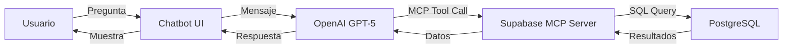

## Chatbot Inteligente

El **Chatbot IA** de Optacost es un asistente conversacional potenciado por **OpenAI GPT-5** con acceso directo a la base de datos de tu laboratorio mediante **Model Context Protocol (MCP)**.

<Info>
El chatbot puede consultar, analizar y responder preguntas sobre tus datos en tiempo real sin necesidad de configuración adicional.
</Info>

## Características Principales

<CardGroup cols={2}>
  <Card title="Acceso SQL Directo" icon="database">
    Ejecuta consultas SQL en tiempo real sobre tu base de datos
  </Card>
  <Card title="Análisis Inteligente" icon="brain">
    Interpreta tus preguntas y genera respuestas contextuales
  </Card>
  <Card title="Datos en Tiempo Real" icon="bolt">
    Accede a información actualizada al instante
  </Card>
  <Card title="Multi-idioma" icon="language">
    Responde en español y otros idiomas
  </Card>
</CardGroup>

## Cómo Funciona

### Arquitectura del Chatbot



### Model Context Protocol (MCP)

El chatbot utiliza MCP para acceder a herramientas:

<Accordion title="¿Qué es MCP?">
**Model Context Protocol** es un estándar abierto que permite a los modelos de IA acceder a herramientas y datos externos de forma segura y estructurada.

En Optacost, el chatbot tiene acceso a:
- **supabase_db_query**: Ejecutar consultas SQL de lectura
- **supabase_db_schema**: Obtener estructura de tablas
</Accordion>

### Ejemplo de Interacción

```typescript
// Usuario pregunta
Usuario: "¿Cuáles son las 5 prácticas más costosas?"

// GPT-5 llama a la herramienta MCP
Tool Call: supabase_db_query({
  query: `
    SELECT
      p.codigo,
      p.nombre,
      p.precio,
      SUM(s.cantidad * s.costo_unitario) as costo_suministros
    FROM pricing p
    LEFT JOIN supplies_with_practices sp ON p.id = sp.practice_id
    LEFT JOIN supplies s ON sp.supply_id = s.id
    GROUP BY p.id
    ORDER BY p.precio DESC
    LIMIT 5
  `
})

// Respuesta del chatbot
Chatbot: "Estas son las 5 prácticas más costosas de tu laboratorio:

1. **Resonancia Magnética Nuclear** (RES001) - $12,500
   Costo de suministros: $2,340

2. **Tomografía Computada Multicorte** (TAC001) - $8,900
   Costo de suministros: $1,890

3. **Panel Genético Completo** (GEN001) - $6,750
   Costo de suministros: $4,200

4. **Ecocardiograma Doppler Color** (ECO001) - $5,200
   Costo de suministros: $320

5. **Holter 24hs** (HOL001) - $4,800
   Costo de suministros: $180

El margen promedio de estas prácticas es del 67%."
```

## Casos de Uso

### Consultas Frecuentes

<AccordionGroup>
  <Accordion title="Análisis de Costos">
    ```
    "¿Cuál fue el costo total de suministros el mes pasado?"
    "Muéstrame el margen de ganancia de las prácticas de laboratorio"
    "¿Qué prácticas tienen el mayor costo de insumos?"
    ```
  </Accordion>

  <Accordion title="Inventario y Suministros">
    ```
    "¿Qué suministros necesito reponer?"
    "Lista los suministros más consumidos este trimestre"
    "¿Cuánto gasto mensual tengo en reactivos?"
    ```
  </Accordion>

  <Accordion title="Estadísticas de Prácticas">
    ```
    "¿Cuáles son las 10 prácticas más realizadas?"
    "Compara el volumen de hemogramas: este mes vs mes anterior"
    "¿Qué laboratorio tiene más actividad?"
    ```
  </Accordion>

  <Accordion title="Reportes Personalizados">
    ```
    "Genera un resumen de costos por laboratorio"
    "Muéstrame las prácticas sin suministros asignados"
    "¿Qué integraciones están activas?"
    ```
  </Accordion>
</AccordionGroup>

## Interfaz del Chatbot

### Popup Flotante

El chatbot está disponible mediante un popup flotante:

<Steps>
  <Step title="Activar chatbot">
    Click en el ícono 💬 en la esquina inferior derecha
  </Step>
  <Step title="Escribir pregunta">
    Escribe tu consulta en lenguaje natural
  </Step>
  <Step title="Recibir respuesta">
    El chatbot analiza y responde en segundos
  </Step>
  <Step title="Continuar conversación">
    El chatbot recuerda el contexto de la conversación
  </Step>
</Steps>

### Características de la UI

- **Responsive**: Funciona en desktop, tablet y mobile
- **Historial**: Mantiene el contexto de la conversación
- **Markdown**: Respuestas formateadas con tablas, listas y código
- **Copiar respuestas**: Click para copiar cualquier respuesta
- **Minimizable**: Oculta el chatbot sin perder la conversación

## Capacidades Técnicas

### Consultas SQL Seguras

El chatbot solo puede ejecutar consultas de **lectura** (SELECT):

<Accordion title="Seguridad del Chatbot">
```typescript
// Configuración de seguridad MCP
{
  allowed_operations: ["SELECT"],
  blocked_operations: ["INSERT", "UPDATE", "DELETE", "DROP", "ALTER"],
  schema_access: "client_{subdomain}", // Solo el schema del cliente
  row_level_security: true // RLS siempre activo
}
```

<Check>
El chatbot **NO puede** modificar, eliminar o alterar datos. Solo lectura.
</Check>
</Accordion>

### Conocimiento del Schema

El chatbot conoce toda la estructura de tu base de datos:

```sql
-- Tablas disponibles
- pricing (prácticas)
- supplies (suministros)
- supplies_with_practices (relaciones)
- historical_pricing (histórico de precios)
- users (usuarios)
- laboratories (laboratorios)
- reportings_full_view (vista de reportes)
-- Y 30+ tablas más...
```

### Límites y Restricciones

| Límite | Valor | Descripción |
|--------|-------|-------------|
| **Tokens por mensaje** | 128,000 | Contexto máximo por consulta |
| **Timeout SQL** | 30 segundos | Límite de ejecución de queries |
| **Resultados** | 1,000 filas | Máximo de registros retornados |
| **Mensajes/día** | Ilimitado | Sin restricción de uso |

## Mejores Prácticas

<AccordionGroup>
  <Accordion title="Sé Específico">
    ✅ **Bueno**: "Muéstrame las 5 prácticas más costosas de noviembre 2024"

    ❌ **Malo**: "Prácticas caras"
  </Accordion>

  <Accordion title="Usa Rangos de Fechas">
    ✅ **Bueno**: "Costos de suministros entre enero y marzo 2024"

    ❌ **Malo**: "Costos de hace unos meses"
  </Accordion>

  <Accordion title="Solicita Comparativas">
    ✅ **Bueno**: "Compara costos de hemogramas: Q1 2024 vs Q1 2023"

    El chatbot puede hacer análisis comparativos automáticamente
  </Accordion>

  <Accordion title="Pide Visualizaciones">
    ✅ **Bueno**: "Genera una tabla con las top 10 prácticas por volumen"

    El chatbot puede formatear respuestas en tablas markdown
  </Accordion>
</AccordionGroup>

## Ejemplos Avanzados

### Análisis de Rentabilidad

```
Usuario: "Analiza la rentabilidad de las prácticas de laboratorio
         considerando precio vs costo de suministros"

Chatbot: "Análisis de rentabilidad de prácticas de laboratorio:

| Práctica | Precio | Costo Suministros | Margen | Rentabilidad |
|----------|--------|-------------------|--------|--------------|
| Hemograma | $1,800 | $360 | $1,440 | 80% |
| Orina Completa | $950 | $180 | $770 | 81% |
| Glucemia | $650 | $95 | $555 | 85% |

**Hallazgos clave:**
- Margen promedio: 82%
- Práctica más rentable: Glucemia (85%)
- Práctica menos rentable: Hemograma (80%)
- Oportunidad: Las prácticas de laboratorio tienen excelente rentabilidad

**Recomendación:** Considera aumentar el volumen de prácticas
con margen superior al 80%."
```

### Detección de Anomalías

```
Usuario: "¿Hay prácticas con costos de suministros superiores al precio?"

Chatbot: "Encontré 3 prácticas con costo superior al precio:

⚠️ **Panel Inmunológico Completo**
- Precio: $4,500
- Costo suministros: $5,200
- Pérdida: -$700 por estudio

⚠️ **Cultivo con Antibiograma Extendido**
- Precio: $2,800
- Costo suministros: $3,100
- Pérdida: -$300 por estudio

⚠️ **PCR Multiplex**
- Precio: $3,900
- Costo suministros: $4,150
- Pérdida: -$250 por estudio

**Acción recomendada:** Actualizar precios o renegociar
costos de suministros para estas prácticas."
```

## Configuración

### Activar/Desactivar Chatbot

Solo usuarios **Admin** pueden configurar el chatbot:

<Steps>
  <Step title="Ir a Configuración">
    Menú → "Configuración" → "Integraciones"
  </Step>
  <Step title="OpenAI Settings">
    Sección "Chatbot IA" → "Configurar"
  </Step>
  <Step title="API Key">
    Ingresar API Key de OpenAI (proporcionada por Optacost)
  </Step>
  <Step title="Activar">
    Toggle "Habilitar Chatbot" → Guardar
  </Step>
</Steps>

## Privacidad y Seguridad

<Warning>
El chatbot tiene acceso de **solo lectura** a tu base de datos. Las consultas se registran en logs de auditoría.
</Warning>

### Garantías de Seguridad

- ✅ **Aislamiento multi-tenant**: Solo accede a datos de tu cliente
- ✅ **Row Level Security**: Respeta políticas RLS de Supabase
- ✅ **Solo lectura**: No puede modificar datos
- ✅ **Logs de auditoría**: Todas las consultas se registran
- ✅ **Conexión encriptada**: HTTPS/TLS en todas las comunicaciones

## Próximos Pasos

<CardGroup cols={2}>
  <Card
    title="API del Chatbot"
    icon="code"
    href="/api-reference/chatbot/enviar-mensaje"
  >
    Integra el chatbot en tus aplicaciones
  </Card>
  <Card
    title="Integración OpenAI"
    icon="microchip"
    href="/arquitectura/integracion-openai"
  >
    Detalles técnicos de la integración
  </Card>
</CardGroup>
