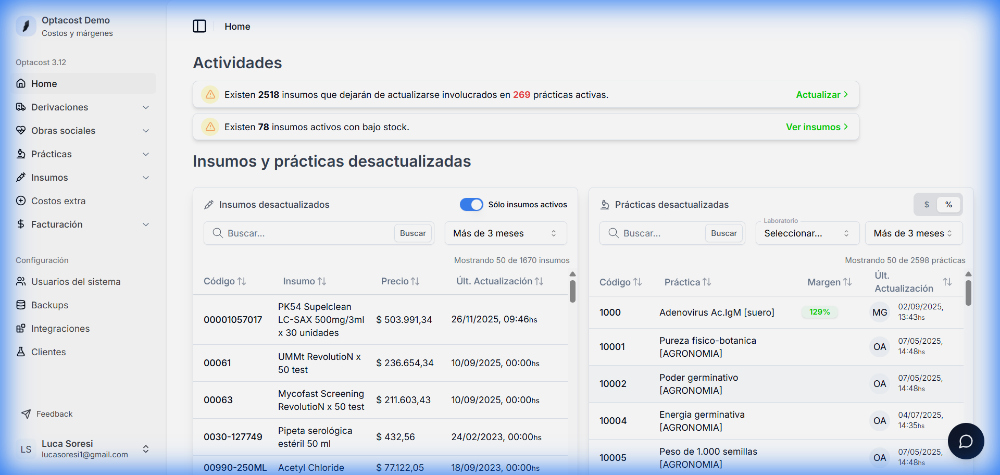
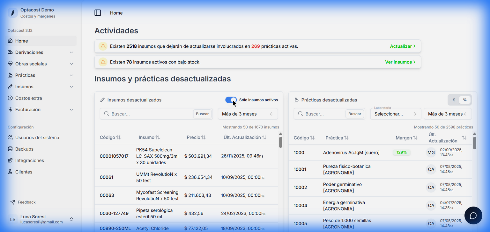
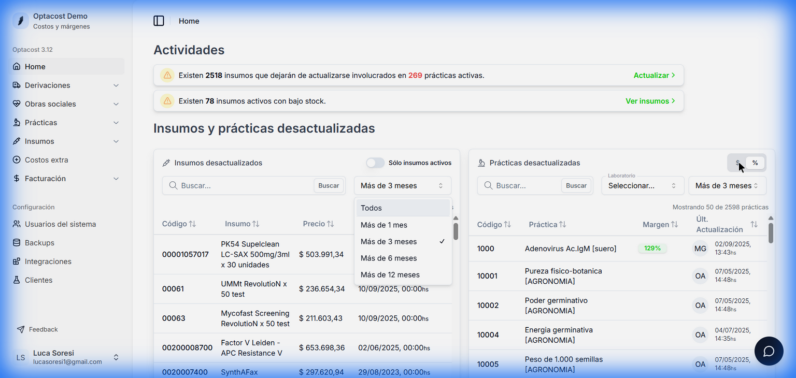

# Dashboard Principal (Home)

La pantalla **Home** es tu centro de comando operativo. A diferencia de otros dashboards que muestran métricas de vanidad, este tablero está diseñado para la **acción inmediata**. Su objetivo es proteger la rentabilidad del laboratorio alertándote sobre costos desactualizados y problemas de stock.

## 1. Sección de Actividades (Alertas)

En la parte superior encontrarás el panel de **Actividades**, que funciona como un semáforo de prioridades. Aquí aparecen las "tarjetas amarillas" o alertas críticas que requieren tu gestión hoy.

### A. Insumos que dejarán de actualizarse
> **Alerta:** "Existen [N] insumos que dejarán de actualizarse..."

*   **¿Qué significa?**: Detectamos que utilizas insumos cuyos códigos han sido discontinuados por el proveedor o reemplazados por nuevas versiones comerciales. Si no haces nada, el precio de estos insumos quedará "congelado" en el tiempo, haciendo que tus costos de prácticas sean irreales.
*   **Acción Requerida**:
    1.  Haz clic en el enlace **"Actualizar >"**.
    2.  Accederás a la herramienta de migración masiva.
    3.  El sistema te sugerirá el insumo reemplazo oficial. Confirma el cambio para actualizar automáticamente todas las recetas que usaban el producto viejo.

### B. Insumos con bajo stock
> **Alerta:** "Existen [N] insumos activos con bajo stock."

*   **¿Qué significa?**: El inventario físico de estos productos está por debajo del punto de pedido configurado.
*   **Acción Requerida**:
    1.  Haz clic en **"Ver insumos >"**.
    2.  Revisa la lista de faltantes y sus cantidades actuales.
    3.  Genera una orden de compra o contacta a tus proveedores para reponer antes de quiebre de stock.

---

## 2. Panel de Insumos Desactualizados (Izquierda)

Esta sección es vital para combatir la inflación. Lista los materiales cuyo precio de costo (lo que pagas al proveedor) no se ha actualizado en mucho tiempo.

### Herramientas de Filtrado

Para trabajar eficientemente, utiliza los controles de la cabecera:

1.  **Switch "Sólo insumos activos"**:
    *   **Activado (Verde)**: Muestra solo los insumos que *actualmente* forman parte de alguna práctica activa. **Recomendado para el uso diario**, ya que prioriza lo que realmente impacta tus costos hoy.
    *   **Desactivado (Gris)**: Muestra todo el catálogo histórico de insumos, incluso los que ya no usas. Útil para auditorías profundas.

2.  **Selector de Antigüedad**:
    *   Define qué consideras "desactualizado".
    *   **Opciones**: *1 mes, 3 meses, 6 meses, 1 año*.
    *   > [!TIP]
    > En contextos de alta inflación, recomendamos revisar semanalmente la vista de **"Más de 1 mes"**.

3.  **Buscador Rápido**:
    *   Localiza insumos específicos por nombre o código interno (ej. "Tubo K3").

### Tabla de Datos

*   **Código**: Identificador único del producto.
*   **Insumo**: Nombre comercial y presentación.
*   **Precio**: Último valor de compra registrado.
*   **Últ. Actualización**: Fecha exacta del último cambio de precio.
    *   *Análisis*: Si ves una fecha de hace 6 meses y sabes que hubo aumentos en el sector, este costo es **falso** y tu rentabilidad real es menor a la que crees.

---

## 3. Panel de Prácticas Desactualizadas (Derecha)

Alerta sobre estudios médicos que podrían estar perdiendo rentabilidad. Ocurre cuando tus costos (insumos + operativos) suben, pero tu precio de venta (arancel) se mantiene fijo.

### Herramientas de Análisis

1.  **Visualización de Rentabilidad (Switch $ / %)**:
    *   **% (Porcentaje)**: Muestra el margen de ganancia sobre el costo.
        *   *Uso*: Ideal para entender la salud relativa del negocio. Un margen del 5% es riesgoso, uno del 129% es saludable.
    *   **$ (Moneda)**: Muestra la ganancia neta en pesos (Precio Venta - Costo Total).
        *   *Uso*: Ideal para entender el impacto en caja. A veces un % alto representa pocos pesos absolutos.

2.  **Filtro de Laboratorio (Secciones)**:
    *   Permite aislar problemas por área técnica (ej. filtrar solo *Microbiología* o *Endocrinología*).
    *   Las iniciales en la columna "Lab" (ej. `MG`) indican la sección.

### Interpretación de la Tabla

Los colores son tu guía rápida:
*   **Verde**: Margen saludable. La práctica cubre sus costos y genera ganancia.
*   **Amarillo**: Alerta de margen decreciente. Revisar costos.
*   **Rojo**: **Margen crítico o negativo**. Estás perdiendo dinero cada vez que realizas esta práctica.

> [!WARNING]
> Si encuentras prácticas en rojo, tienes dos caminos inmediatos:
> 1.  **Renegociar aranceles** con las Obras Sociales basándote en el aumento de costos demostrable.
> 2.  **Optimizar costos**, buscando insumos alternativos más económicos.

---

## Flujo de Trabajo Semanal Recomendado

Para mantener el sistema sano, sugerimos esta rutina de 5 minutos cada lunes:

1.  Entra al **Home**.
2.  Limpia las **Alertas de Actividades** (migra insumos viejos).
3.  En **Insumos Desactualizados**, selecciona "Más de 1 mes".
    *   Toma las facturas de la semana y actualiza los precios de los insumos listados.
4.  Mira el panel de **Prácticas**.
    *   Filtra por márgenes más bajos.
    *   Si ves rojos, agenda una reunión de revisión de costos.
